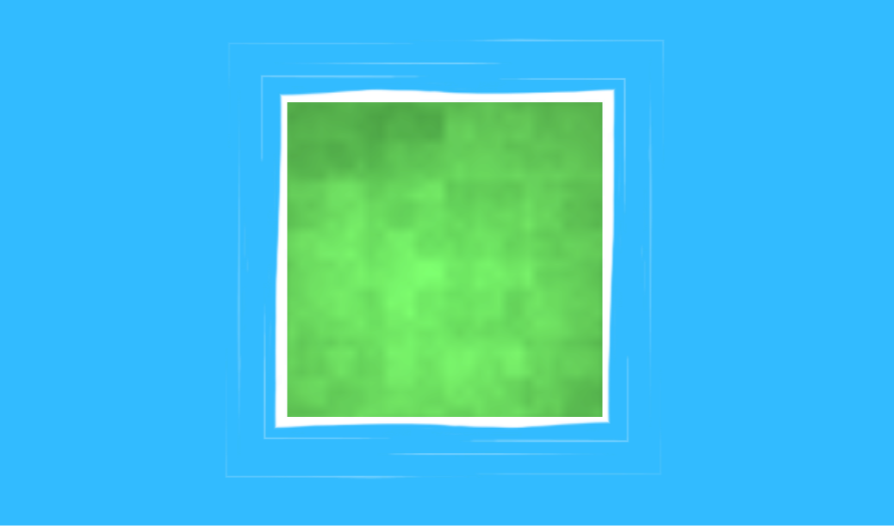

# Octave Simple Water

A stylized **Wind Waker–style water** demo for the [Octave](https://github.com/mholtkamp/octave) engine (targeting the GameCube/Wii libogc backend via [Octave-libogc](https://github.com/myuu-151/Octave-libogc)).

## What it does

- **Opaque stylized water surface** with scrolling UV layers.
- **Seamless scrolling shoreline foam** — a mitered ribbon built around the pond's boundary, with the wavy foam line crawling around the edge with no seam.
- **Per-object silhouette foam rings** — a foam outline around anything sitting in the water. Each ring is baked from the object's cross-section at the waterline, then at runtime it:
  - **pins** to the water surface (won't sink with the object),
  - **follows** the object's position and yaw,
  - **hides** when the object leaves the water.

All of it runs on both the desktop editor (Vulkan) and real GameCube/Wii hardware (GX).

## Open it

Open `water.octp` in the Octave editor. The scene `SC_Water` loads with the pond, water, foam, and a few test cubes. Press **Play**, or export to GameCube/Wii from the **Build** menu.

## How the foam is made

`Scripts/Water.lua` handles all the runtime behavior (surface + foam UV scrolling, ring pinning/following/hiding).

The foam **geometry** is baked by a Blender-run Python generator (`gen_water_assets.py`, in the source project) that:
1. slices each object mesh against the water plane to get its waterline silhouette,
2. builds a mitered, seamless foam ribbon around it,
3. walks the water mesh boundary to build the shoreline band.

For a fully static scene you can skip the generator entirely and just model the foam rings in Blender — the runtime script only needs the meshes and the water node.

## Notes / limits

- The foam is stylized *surface-crossing* foam (geometry-based), **not** depth-buffer intersection foam — that needs a depth texture GX can't sample. Objects glowing foam while fully submerged is out; foam around things breaking the surface is in.
- Rings are baked per object; re-run the generator (or re-model) if you change object shapes.

## License

MIT
